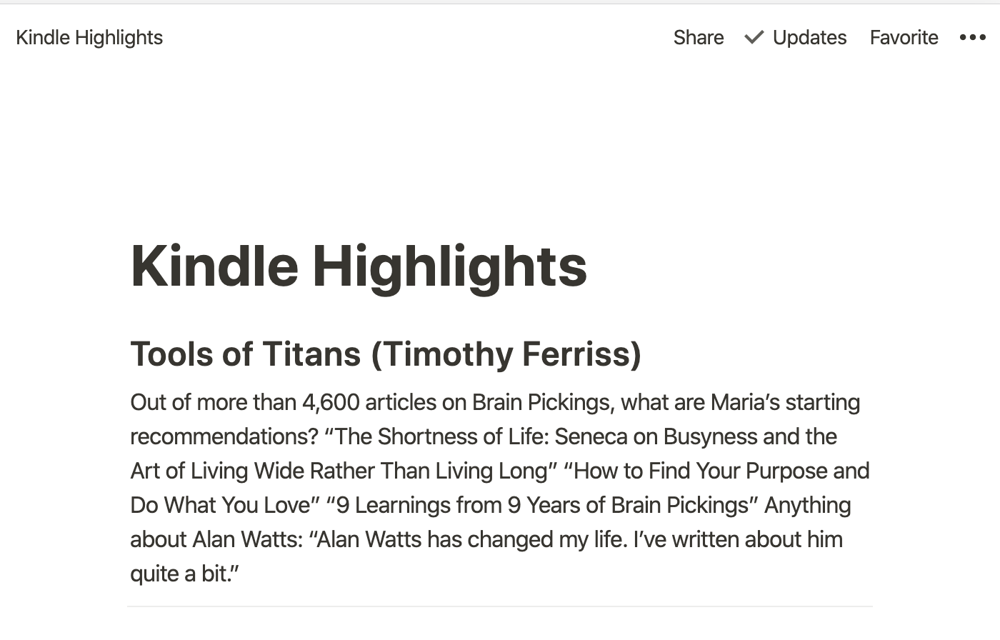

# notionfy: 📓 to 🏗 -> ♥

### Sync your Kindle highlights to [Notion](https://www.notion.so/)

This script reads the `clippings.txt` from your kindle and syncs all the highlight to a selected notion page.

### Install

Download the [notionfy](https://github.com/yannick-cw/notionfy/releases/tag/0.1) executable and place it in your `PATH` or run it directly with `./notionfy`. Don't forget to make it executable with `chmod +x notionfy`.

On Mac you may also give it permission to run in `System Preferences -> Security & Privacy`

### Setup

1. Get the `token_v2` token from https://www.notion.so/

- when using chrome [here](https://developers.google.com/web/tools/chrome-devtools/storage/cookies) is some info on how to read a cookie

2. Create a new, empty page and copy the id

- e.g. `https://www.notion.so/Kindle-Highlights-5129b8f88a414b8e893469b2d95daac8`
- take `5129b8f88a414b8e893469b2d95daac8`

3. Connect you kindle to your machine and get the path to the kindle (on Mac this is `/Volumes/Kindle`)
4. run `notionfy-exe` with:

```bash
notionfy -n "notion_token" -p "parent_page_id" -k "kindle_path"
```

5. See the highlights added to notion page



